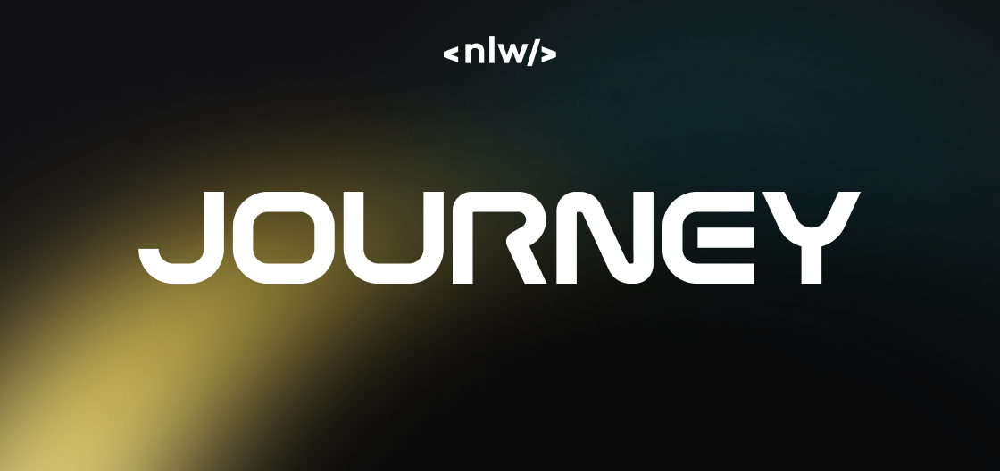
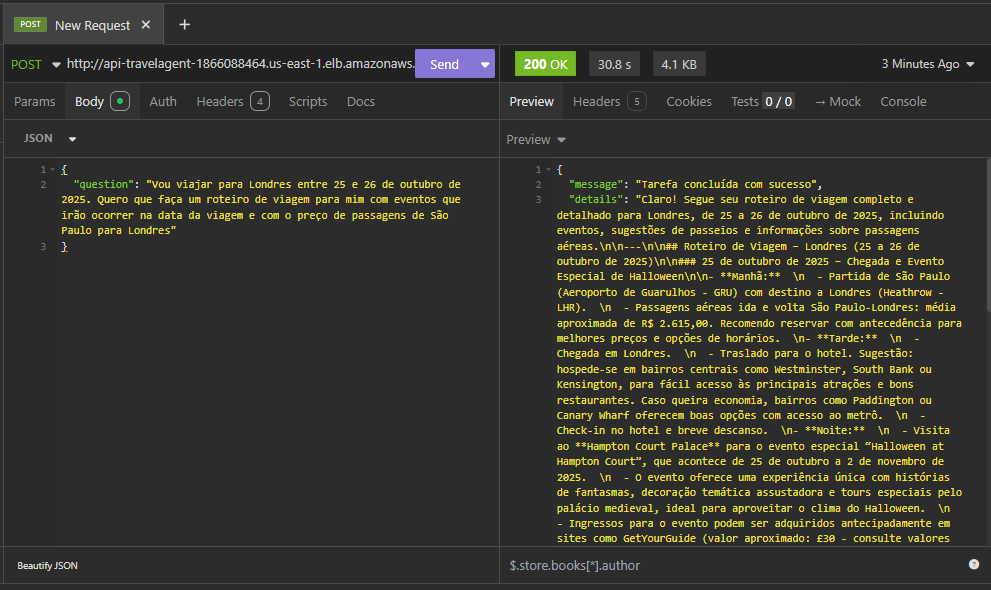

<h1 align="center"> NLW Journey IA - Travel Agent </h1>
<h3 align="center">
Seu roteiro de viagem personalizado com IA!
</h3>

<p align="center">
  <a href="#-sobre">Sobre</a>&nbsp;&nbsp;&nbsp;|&nbsp;&nbsp;&nbsp;
  <a href="#-funcionalidades">Funcionalidades</a>&nbsp;&nbsp;&nbsp;|&nbsp;&nbsp;&nbsp;
  <a href="#-para-devs">Para Devs</a>
&nbsp;&nbsp;&nbsp;|&nbsp;&nbsp;&nbsp;
  <a href="#-tecnologias">Tecnologias</a>&nbsp;&nbsp;&nbsp;|&nbsp;&nbsp;&nbsp;
  <a href="#memo-licença">Licença</a>&nbsp;&nbsp;&nbsp;|&nbsp;&nbsp;&nbsp;
  <a href="#-autor">Autor</a>
</p>

<p align="center">
  
</p>

<br><br>
## ℹ️ Sobre 

<p align="justify">
A Next Level Week (NLW) é um evento exclusivo e gratuito promovido pela Rocketseat, oferecendo uma experiência prática com desafios e muito código para o ensino de novas tecnologias.

<p align="center">
  
</p>

<br/><br/>
Este projeto, desenvolvido durante a trilha de IA, é uma API de "agente de viagem". A API realiza pesquisas na internet para criar um roteiro de viagem customizável para o usuário, oferecendo uma experiência única e personalizada.
</p>

## 🔍 Funcionalidades


Este projeto é uma API que atua como um agente de viagens personalizado. Ao receber um destino e datas, a API:

- Pesquisa eventos que ocorrerão na região durante as datas da viagem.
- Busca custos de passagens (ex: São Paulo para Londres).
- Sugere os melhores restaurantes.
- Informa sobre documentos importantes necessários para a viagem.
- Compila todas essas informações e retorna um roteiro de viagem detalhado.

### Exemplo de Uso

Para utilizar a API, envie uma requisição POST para o endpoint do seu Load Balancer, conforme o exemplo abaixo:

**Endpoint:** `http://http://seu-load-balancer-dns.<regiao>.elb.amazonaws.com`

**Método:** `POST`

**Body:**
```json
{
  "question": "Vou viajar para Londres entre 25 e 26 de outubro de 2025. Quero que faça um roteiro de viagem para mim com eventos que irão ocorrer na data da viagem e com o preço de passagens de São Paulo para Londres"
}
````

**Exemplo com cURL:**

```bash
curl -X POST "[http://http://seu-load-balancer-dns.<regiao>.elb.amazonaws.com](http://http://seu-load-balancer-dns.<regiao>.elb.amazonaws.com)" \
-H "Content-Type: application/json" \
-d '{
  "question": "Vou viajar para Londres entre 25 e 26 de outubro de 2025. Quero que faça um roteiro de viagem para mim com eventos que irão ocorrer na data da viagem e com o preço de passagens de São Paulo para Londres"
}'
```

<p align="center">
  
</p>

## 👨‍💻 Para Devs


### Pré-requisitos

Antes de começar, você vai precisar ter instalado em sua máquina as seguintes ferramentas:

  * [Docker](https://www.docker.com/)
  * [AWS CLI](https://aws.amazon.com/cli/)
  * Uma conta na [AWS](https://aws.amazon.com/) configurada

### Deploy na AWS

Abaixo estão as instruções breves para fazer o deploy da aplicação na AWS:

1.  **Build da Imagem Docker:**
    Construa a imagem Docker do projeto.
    *Nota: Pode ser necessário desabilitar o BuildKit para compatibilidade com a imagem base da Lambda. Para PowerShell, use:*

    ```bash
    $env:DOCKER_BUILDKIT=0
    docker build -t travel-agent .
    ```

2.  **Enviar Imagem para o ECR:**
    Autentique-se no Amazon Elastic Container Registry (ECR) e envie a imagem que você acabou de construir.

3.  **Criar Função Lambda:**
    No console da AWS, crie uma nova função Lambda. Escolha a opção "Imagem de contêiner" e selecione a imagem que você enviou ao ECR.

4.  **Criar Load Balancer:**
    Crie um Application Load Balancer (ALB) para expor sua função Lambda publicamente.

5.  **Integrar ALB e Lambda:**
    Crie um grupo de destino (Target Group) para o seu ALB que aponte para a função Lambda. Configure o listener do ALB para encaminhar o tráfego HTTP/HTTPS para este grupo de destino.

## 🚀 Tecnologias

Esse projeto foi desenvolvido com as seguintes tecnologias:

  - Python 3.12
  - LangChain (Classic, Community, OpenAI)
  - OpenAI (GPT-4.1-mini)
  - DuckDuckGo Search (DDGS)
  - Wikipedia
  - ChromaDB
  - Beautiful Soup (bs4)
  - AWS Lambda
  - AWS ECR
  - AWS ELB
  - Docker
  - Git e Github

[](https://skillicons.dev)


## :memo: Licença

Esse projeto está sob a licença MIT.

## 🤵 Autor
<div align="center">

<h1>Marlon Akio Tochiro</h1>
<strong>Student Developer ⓒ 2023</strong>
<br/>
<br/>

<a href="https://www.linkedin.com/in/marlon-akio-ba1763134/" target="_blank">

</a>

<a href="https://github.com/marlonakio" target="_blank">

</a>

<a href="mailto:marlon.akto@gmail.com" target="_blank">

</a>

<a href="https://wa.me/5511977769829?text=Ol%C3%A1%21" target="_blank">

</a>

<br/>
<br/>
</div>
